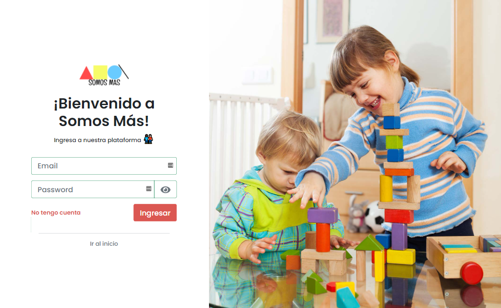
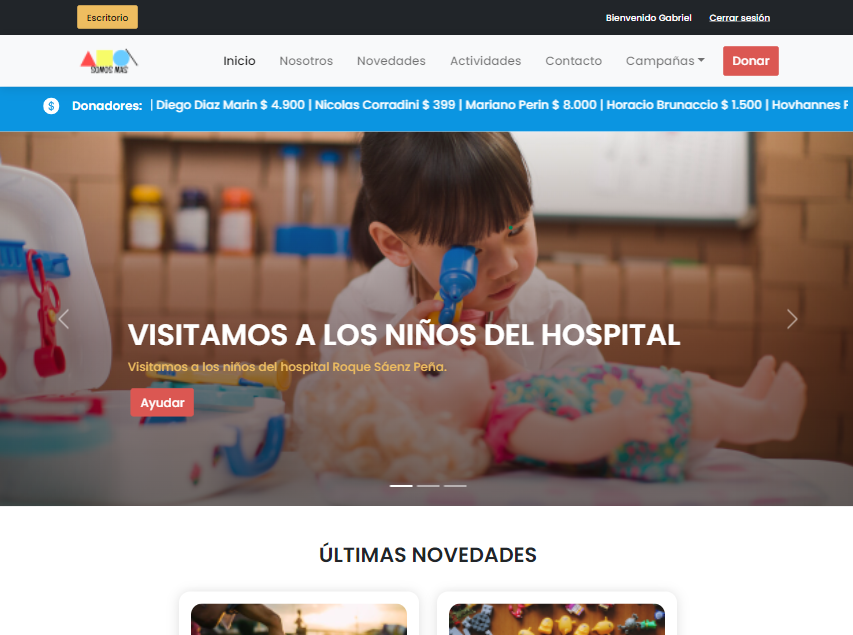
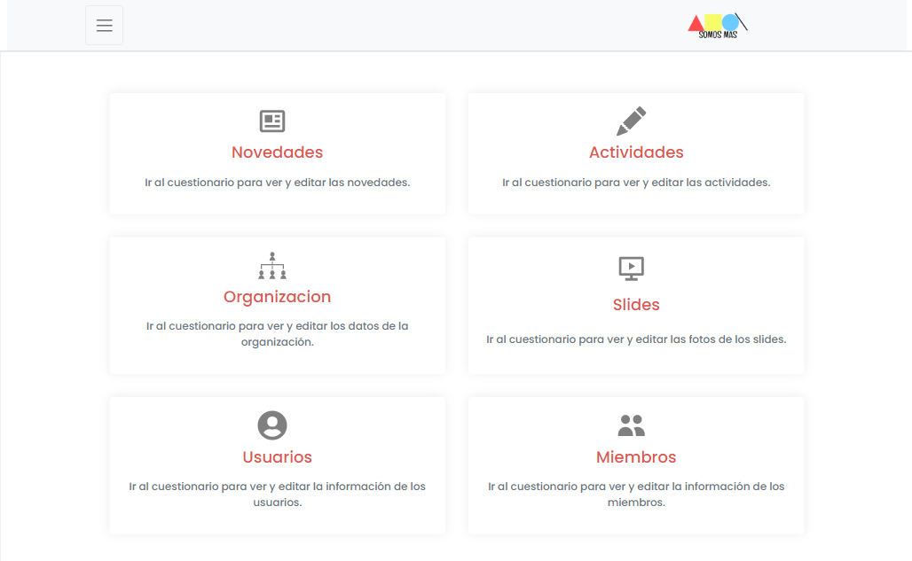
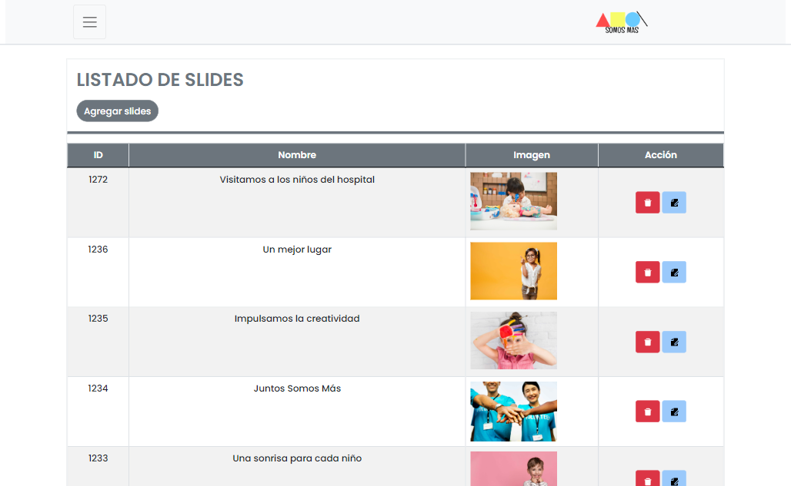
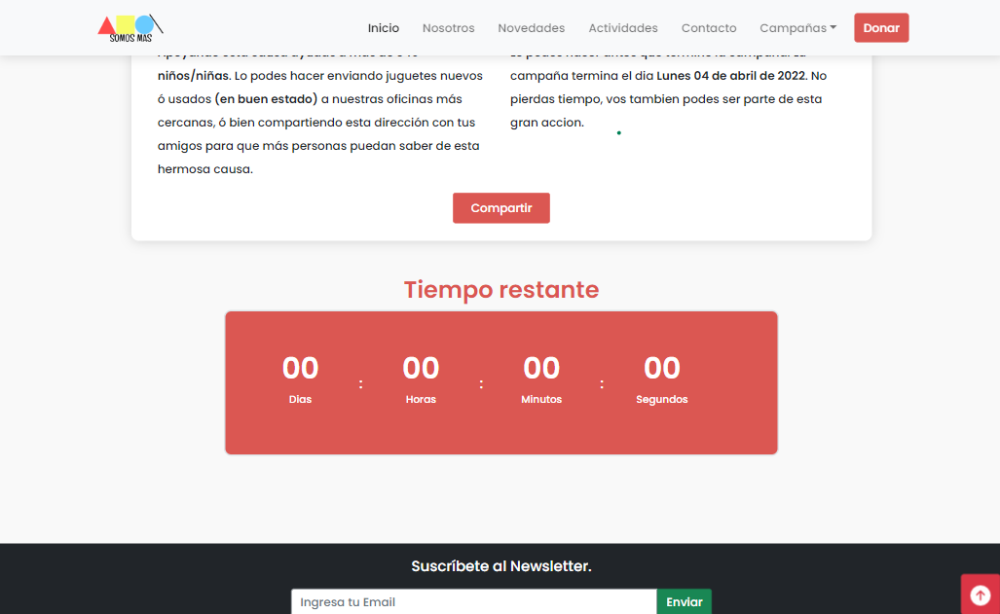
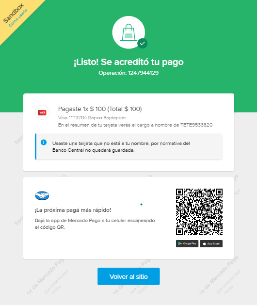
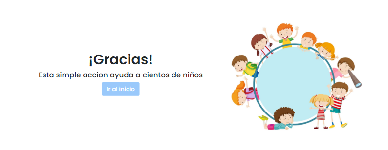

# Ong Client

This project was bootstrapped with [Create React App](https://github.com/facebook/create-react-app), using the [Redux](https://redux.js.org/) and [Redux Toolkit](https://redux-toolkit.js.org/) template.

# Grupo Reactors | ONG SOMOS MAS - Alkemy 

## Caracteristicas de la App
 La aplicación se basó en una web para una ONG (Somos más), donde se podra visualizar información de la organización, acciones,
   actividades, miembros y demas... Ademas cuenta con un panel de administración donde los usuarios podran, crear, editar y eliminar
   ciertas secciones del front, como ser actividades, slides, textos, miembros, etc.

## Caracteristicas de la App

- [x] Single Page Aplication (SPA).
- [x] Gestion del estado Redux
- [x] Panel de administración para usuarios
- [x] Rutas protegidas
- [x] Persistencia del usuario
- [x] Recepcion de donaciones (Mercado Pago)
- [x] Videos
- [x] Contenido interactivo
- [x] Framework css Bootstrap
- [x] Tecnologia ReactJS
- [x] Login 
- [x] Creación de usuarios
- [x] Personas que trabajaron en esta aplicación: (8)


## ScreenShots 

<p align="center">
  
  
  
  
  
  
  
    

</p>


## Demo Aplicación

### Deploy
- https://alkemy-tech-ong-somos-mas.vercel.app/

### O si quieres correrlo en local
```
# Clone this repository
$ git clone https://github.com/ginigo-arg/Alkemy-Tech-ONG-SomosMas.git
# Go into the repository
$ cd repo-clonado

# Install dependencies
$ npm install

# Run the app
$ npm start
$ checkea las variables de entorno
```

# Mercado Pago
## Probando el boton de donacion
- Deberar loguearte con cualquiera de las siguientes cuentas Tests de MP.

- TEST USER 1
 "id": 1111955504,
 "nickname": "TETE9533620",
 "password": "qatest8838",
 "site_status": "active",
 "email": "test_user_67107888@testuser.com"

 - TEST USER 2
  "id": 1111948655,
  "nickname": "TETE6543581",     
  "password": "qatest8663",
  "site_status": "active",
   "email": "test_user_23875954@testuser.com" 


## Acceso App
- User: gabi@gabi.com
- Pass: gabriel123!
 o podes crearte un nuevo usuario
